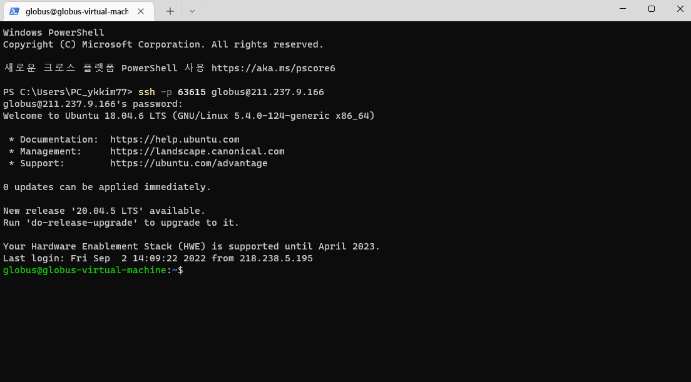
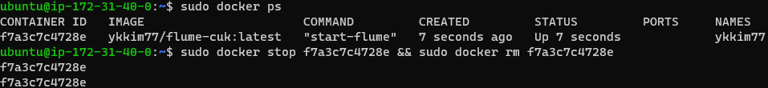

# 클라우드 기반의 도커 실습 환경 가이드

- 본 가이드는 로컬 환경에서 도커를 설치하지 못하시는 분들을 위해 작성이 되었으며, 실습 환경은 서로 공유될 수 있습니다. 
  실습환경의 비밀번호는 과목 공지 게시판을 확인해 주시길 바랍니다.


## Windows Terminal 실행

- 아래와 같이 ssh 접속 명령어 입력 실습 서버는 학생들의 동시 접속을 원활하게 하기 위해 4개를 제공합니다. 4개의 서버 중 하나를 선택하여 접속하면 됩니다.

  * 1번 서버

    ```
    ssh -p 63615 globus@211.237.9.166
    ```

  * 2번 서버

    ```
    ssh -p 63615 globus@211.237.9.167
    ``` 

  * 3번 서버

    ```
    ssh -p 63615 globus@211.237.9.168
    ```

  * 4번 서버

    ```
    ssh -p 63615 globus@211.237.9.169
    ``` 

- 비밀번호 입력 후 우분투 접속

  


- 클라우드 실습시 주의 사항

  * 모든 docker 명령어 사용시 앞에 sudo 명령어를 붙일 것!!! (비밀번호를 입력요구할 시 비밀번호 추가 입력)
  * 실습 환경을 타 학생과 공유 하므로, 실습이 끝나고 난 뒤 반드시 자신이 수행중인 컨테이너를 삭제할 것!!!!!
    + 삭제 예 : sudo docker stop f7a3c7c4728e && sudo docker rm f7a3c7c4728e
      
      